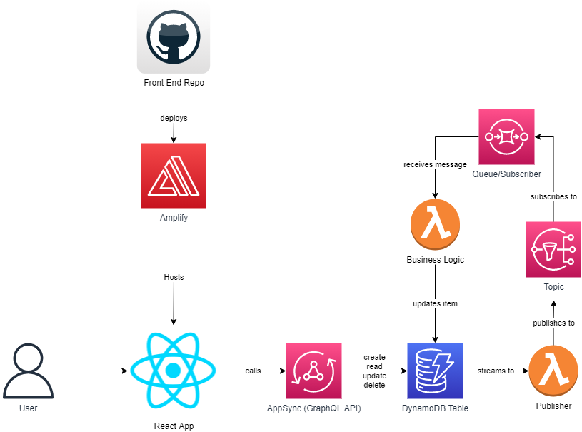

# rts

Architecture Overview

## The Project

This project contains source code and supporting files for a serverless application that you can deploy with the SAM CLI. It includes the following files and folders.

- business_logic - Code for the application's Lambda function.
- publisher - Code for the application broadcast function.
- template.yaml - A template that defines the application's AWS resources.
- client - The react frontend application

## CI/CD Pipelines

This project currently only contains a front-end deployment Pipeline through Amplify, but I would use sam pipelines with GitHub actions to deploy the AWS resources

